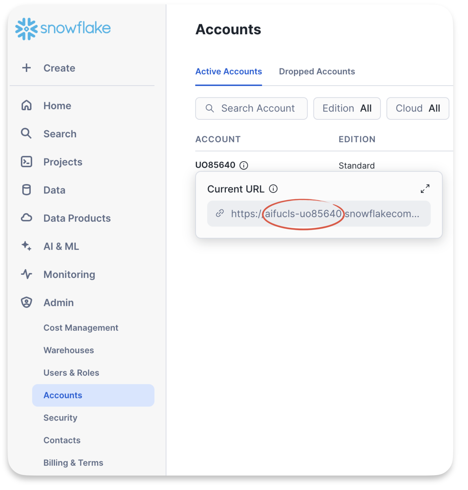

# Snowflake DWH on AWS

Dieses Projekt hat den Zweck eine data warehouse Umgebung einzurichten in der ich verschieden dinge ausprobieren kann, bzw. verschiedene technicken kombiniert einsetzen möchte.
1. Einrichten eines aws projects und eine rolle zum erstellen der infrastruktur
2. Einrichtungen der Infrastruktur mit der hilfe von terraform
3. Eirichten der snowfalke datenbank und Einbinden der raw daten
4. Einrichten von dbt als transformations werkzeug mit zugriff auf das dwh
5. modelieren der daten 
6. einrichten eines containers mit einem BI tool (Metabase)
6. Beantworten von fragen mittels der Daten und visualisierung in einem dashoard


# Vorausssetzungen
- terraform
- snowflake cli (snowsql)
- aws cli
- dbt cloud (account and cli) [install dbt cloud cli](https://docs.getdbt.com/docs/cloud/cloud-cli-installation)
- dotenv (um Umgebungsvariablen aus der .env datei zu handeln)


## setup
- erstelle ein `-env` file um verschiedene variablen abzulegen.   
    $`mv .env.example .env`


## AWS Account anlegen und per CLI darauf zugreifen

- Ich erstelle in der AWS Console in meinem aws account eine organisation und inerhalb dieser Organisation neuen Account 
- Nun gewäre ich in meinem `IAM Identity Center` meinem bestehenden User `AdministratorAccess` auf diese neue Konto via sso. 
- Außerdem kopiere ich unter Einstellungen die `AWS access portal-URL` als `AWS_SSO_START_URL` in meine `.env`
- Nun logge ich mich über die CLI auf diesem neuen Account ein mit `aws configure sso`. der hierbei verwendete Profilname wird in der `.env` und `AWS_PROFILE` abgelegt, dieser ist nötig um alle aws befehle die aus diesem ordner ausgeführt werden an das richtige konto zu senden. Führe `direnv reload` aus um die umgebungsvariablen zu laden.
- Nun logge dich in die console (Webseite) des neuen account ein indem du der `AWS_SSO_START_URL` folgst und dich mit deinem bestehenden user auf dem neuen account einloggst.
- Mit `aws sts get-caller-identity` kannst du aus deinem localen Terminal nun überprüfen, ob du mit der CLI auf das gleich konnt zugriff hast. Webseite und CLI sollten die gleiche Account ID ausgeben.
Benutze `make get_aws_id` um die ID in deiner `.env` zu speichern.

Nun haben wir alle nötigen Schritte unternonnem, um via via cli änderungen an unserem aws konto vor zu nehmen. Wir wollen nun einen user anlegen, den terraform benutzen kann um die restliche konfiguration des Kontos vorzunehmen.

dazu führen wir einfach `make setup_aws` aus.
dieser befehl prüft ob alles nötige vorhanden ist, richtet einen terraform user ein und weist diesem die nötigen berechtigungen zu.
Damit ist aws bereit für die weiter einrichtuing via terrafrom.
 

## Schritt 2: Snowflake Account anlegen und über CLI darauf zugreifen
- Ich erstelle einen neuen account (30 tage testzeitraum). Hierbei ist es wichtig, dass die instance auf AWS und in der richtigen region erstellt wird.
- Um snowflake zu konfigurieren wollen wir zuerst über das admin konto eine cli verbindung aufbauen. 
Dazu benötigen wir die den dazu gehörigen account identifier.
- übernehme folgende Werte in die .env datei: 

    - `SNOWFLAKE_ACCOUNT` & `SNOWFLAKE_ORGANIZATION` (siehe abbildung)
    - den benutzernamen, der beim anlegen des accounts verwendet wurde als `SNOWFLAKE_ADMIN` 
    - und das dazu gehörige Passwort als `SNOWFLAKE_PWD`.  



Nun können wir mit folgendem befehl mit der Snowfalke instance verbinden.  
    ```
    snowsql -a $SNOWFLAKE_ACCOUNT_IDENTIFIER -u $SNOWFLAKE_ADMIN
    ```

Wenn die variable `SNOWFLAKE_PWD` existiert nimmt snowsql diese automatisch als passwort zum einloggen, ist sie nicht gesetzt, muss das passwort eingegeben werden.

Alternative können wir diesen auch mit `make snowflake_test` die verbingung testen.
Wenn alles gesetzt ist, können wir mit `make setup_snowflake` einen terraform Benutzer anlegen und diesem die nötige berechtigung zum einrichten unsere Snowflake instance geben.

Nun legen wir auch für snowflake einen Terraform service user an, zur autentifiziereung nutzen wir hier einen ssh key.
```
make snowflake_create_Terraform_user
```

oder die gesamte snowflake einrichtung at once mit `make setup_snowflake`


# Terraform
Alle weiteren Schritte der Einrichtung werden nun von terrafrom übernommen.
Folgende Komponennten werden eingerichtet:
## Aws
- S3 bucket als datalake
- S3 Bucket als backend (Terrafrom logs und state)
- Snowflake user um den Bucket zu lesen


