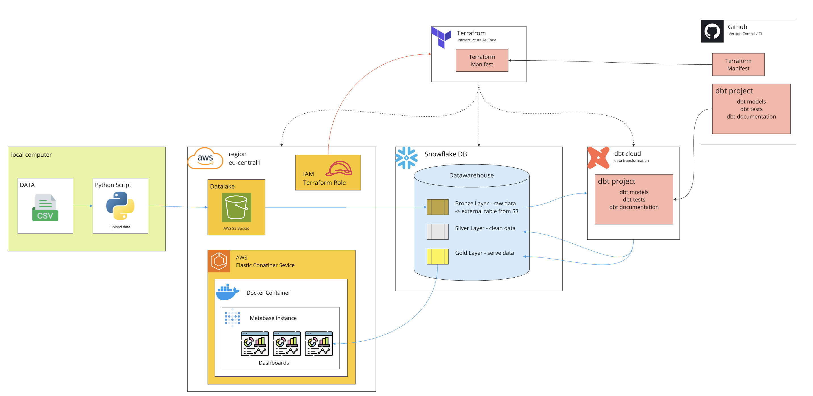

# DWH to go [WIP]

A "one-click" data platform.

### Introduction

As I’ve delved into data engineering, I’ve experimented with various data warehouse solutions and implemented several projects. A recurring challenge, however, has always been **costs**.

### The Idea

This project aims to create a reusable, cost-effective setup that leverages free-tier offerings from various providers:

- **AWS** (12-month Free Tier)
- **Snowflake** (30-day Free Trial)
- **dbt Cloud** (Free Developer Plan for one project)
- **Metabase** (running in a container)

### The Solution

A GitHub repository providing a modular, scalable data platform that can be set up in a few steps. This platform serves as a playground for experimenting with different tools, techniques, and architectures.

---

### Architecture Overview



**Cloud Provider:** AWS

**Data Warehouse:** Snowflake

**Transformation Layer:** dbt

**Business Intelligence (BI):** Metabase

**Infrastructure as Code (IaC):** Terraform / Bash / Python

---

### Prerequisites

This project has been developed and tested on macOS (M2). Ensure the following tools are installed:

- **AWS CLI** (v2.21.2)
- **Snowflake CLI** (`snowsql` v1.3.1)
- **Terraform** (v1.10.1)
- **Python** (v3.9.11 with dependencies from `requirements.txt`)
- **dbt Cloud** (Cloud account and CLI; [installation instructions](https://docs.getdbt.com/docs/cloud/cloud-cli-installation))
- **direnv** (v2.33.0 to manage environment variables from the `.env` file)

---

## Setup Guide

### Step 1: Configure Environment Variables

- Create an environment file by copying the example template:
    
    ```bash
    mv .env.example .env
    ```
    
- Populate the `.env` file with the necessary variables as you progress through the setup.

---

### Step 2: AWS Account Setup and CLI Configuration

1. **Create an AWS Account:**
    - Register a new account via the AWS Console. If using AWS Organizations, create the account under your organization.
    - Assign `AdministratorAccess` to your user for this new account via **IAM Identity Center**.
2. **Set Up AWS CLI Access:**
    - Copy the `AWS access portal URL` from **IAM Identity Center** into your `.env` file as `AWS_SSO_START_URL`.
    - Log in via the CLI:During the process, you’ll specify a profile name, which must be saved in `.env` as `AWS_PROFILE`.
        
        ```bash
        aws configure sso
        ```
3. **Verify AWS CLI Access:**
    - Log into the AWS Management Console using `AWS_SSO_START_URL`.
    - Check CLI access by running
        
        ```bash
        aws sts get-caller-identity
        ```
        Ensure the `Account ID` matches the one in the AWS Console.
        
    - Save the account ID to your `.env` using:
        
        ```bash
        make aws_get_account_id
        ```
4. **Prepare Terraform Access to AWS:**
    
    Run the following to create a Terraform service user with the required permissions:
    
    ```bash
    make aws_create_terraform_user
    ```
---

### Step 3: Snowflake Account Setup and CLI Configuration

1. **Create a Snowflake Account:**
    - Sign up for a 30-day trial. Ensure the instance is deployed on AWS and in the correct region.
2. **Configure Snowflake CLI Access:**
    - Update `.env` with the following values:
        - `SNOWFLAKE_ACCOUNT_NAME` and `SNOWFLAKE_ORGANIZATION_NAME` (visible in the account details section)
        - `SNOWFLAKE_ADMIN` (your Snowflake admin username)
        - `SNOWFLAKE_PWD` (the password you set for the admin account).
    - Reload your environment variables:
        
        ```bash
        direnv reload
        ```
        
3. **Test Snowflake Connection:**
    - Use the Snowflake CLI to connect:
        
        ```bash
        snowsql -u $SNOWFLAKE_ADMIN
        ```
        
    - Alternatively, test the connection via:
        
        ```bash
        make snowflake_test
        ```
        
4. **Set Up Snowflake for Terraform Access:**
    
    Run the following to create a service user and set up necessary permissions:
    
    ```bash
    make setup_snowflake
    ```
    
    For SSH-based authentication, generate an SSH key for the Terraform user:
    
    ```bash
    make snowflake_create_terraform_user
    ```
    

---

### Step 4: Infrastructure Deployment via Terraform

Run Terraform to deploy the infrastructure:

```bash
make aws_terraform
```

Terraform will provision the following AWS components:

- **S3 Bucket** (as a data lake)
- **ECS Cluster** running Metabase in a container
- **RDS PostgreSQL** instance (backend for Metabase)
- Public and private subnets for the ECS and RDS components
- Security groups for the RDS and ECS services

Due to known limitations with the Snowflake Terraform module, Snowflake resources are managed using Python scripts:

```bash
make setup_snowflake
```

---

### Step 5: Load Test Data

Run the following script to load test data into Snowflake:

```bash
make test_data
```

This script will:

- Upload sample data to S3
- Set up AWS-Snowflake data integration
- Create staging layers, data formats, schemas, and tables
- Copy the sample data into Snowflake

---

### Next Steps

- Configure your dbt Cloud account and connect it to Snowflake.
- Deploy the Metabase container with Terraform.
- Expand the platform by adding more components and integrating additional tools.
