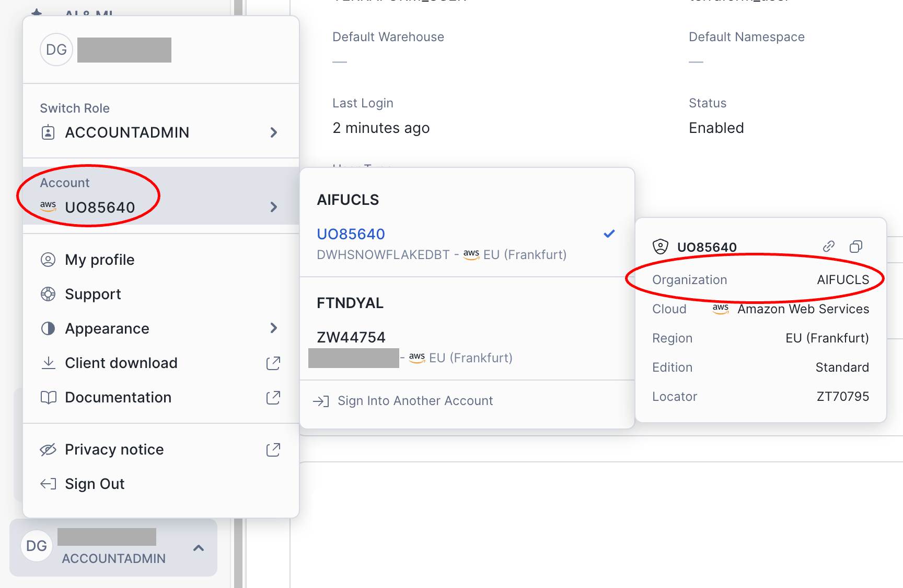

# Snowflake DWH on AWS

Dieses Projekt hat den Zweck eine data warehouse Umgebung einzurichten in der ich verschieden dinge ausprobieren kann, bzw. verschiedene technicken kombiniert einsetzen möchte.
1. Einrichten eines aws projects und eine rolle zum erstellen der infrastruktur
2. Einrichtungen der Infrastruktur mit der hilfe von terraform
3. Eirichten der snowfalke datenbank und Einbinden der raw daten
4. Einrichten von dbt als transformations werkzeug mit zugriff auf das dwh
5. modelieren der daten 
6. einrichten eines containers mit einem BI tool (Metabase)
6. Beantworten von fragen mittels der Daten und visualisierung in einem dashoard


# Vorausssetzungen
- terraform
- snowflake cli (snowsql)
- aws cli
- dbt cloud (account and cli) [install dbt cloud cli](https://docs.getdbt.com/docs/cloud/cloud-cli-installation)
- dotenv (um Umgebungsvariablen aus der .env datei zu handeln)

#Planung:
## setup
- erstelle ein `-env` file um verschiedene variablen abzulegen
- definiere die aws region (z.b. eu-central-1)

## AWS Account anlegen und per CLI darauf zugreifen

- Ich erstelle in der AWS Console in meinem aws account eine organisation und inerhalb dieser Organisation neuen Account 
- Nun gewäre ich in meinem `IAM Identity Center` meinem bestehenden User `AdministratorAccess` auf diese neue Konto via sso. 
- Außerdem kopiere ich unter Einstellungen die `AWS access portal-URL` als `AWS_SSO_START_URL` in meine `.env`
- Nun logge ich mich über die CLI auf diesem neuen Account ein mit `aws configure sso`. der hierbei verwendete Profilname wird in der `.env` und `AWS_PROFILE` abgelegt, dieser ist nötig um alle aws befehle die aus diesem ordner ausgeführt werden an das richtige konto zu senden. Führe `direnv reload` aus um die umgebungsvariablen zu laden.
- Nun logge dich in den neuen account ein indem du der `AWS_SSO_START_URL` folgst und dich mit deinem bestehenden user auf dem neuen account einloggst.
- Mit `aws sts get-caller-identity` kannst du nun überprüfen, ob du mit der CLI auf das gleich konnt zugriff hast.
Benutze `make get_aws_id` um die ID in deiner `.env` zu speichern.

Nun haben wir alle nötigen Schritte unternonnem, um via via cli änderungen an unserem aws konto vor zu nehmen. Wir wollen nun einen user anlegen, den terraform benutzen kann um die restliche konfiguration des Kontos vorzunehmen.

dazu führen wir einfach `make configure_aws` aus.
dieser befehl prüft ob alles nötige vorhanden ist, richtet einen terraform user ein und weist diesem die nötigen berechtigungen zu.
Damit ist aws bereit für die weiter einrichtuing via terrafrom.
 

## Schritt 2: Snowflake Account anlegen und über CLI darauf zugreifen
- Ich erstelle einen neuen account (30 tage testzeitraum). Hierbei ist es wichtig, dass die instance auf AWS und in der richtigen region erstellt wird.
- Um snowflake zu konfigurieren wollen wir zuerst über das admin konto eine cli verbindung aufbauen. 
Dazu benötigen wir die den dazu gehörigen account identifier.
- übernehme folgende Werte in die .env datei: `SNOWFLAKE_ACCOUNT_IDENTIFIER` (siehe abbildung), den benutzernamen, der beim anlegen des accounts verwendet wurde als `SNOWFLAKE_ADMIN` und das dazu gehörige Passwort als `SNOWFLAKE_PWD`.

Nun können wir mit folgendem befehl mit der Snowfalke instance verbinden. 
    ```
    snowsql -a $SNOWFLAKE_ACCOUNT_IDENTIFIER -u $SNOWFLAKE_ADMIN

    ```
Wenn die variable `SNOWFLAKE_PWD` existiert nimmt snowsql diese automatisch als passwort zum einloggen, ist sie nicht gesetzt, muss das passwort eingegeben werden.

Alternative können wir diesen auch mit `make test_snowflake`.

## Schritt 3: dbt account anlegen und über cli darauf zugreifen


 

- über IAM weise ich einem bestehenden nutzer der Organisation die administrator rolle für den neuen account zu. 
- Erstelle eine IAM-Rolle für Terraform:
    - erstellen von 
    - Berechtigungen für S3, ECS, und die Dienste, die Terraform benötigt.


Zugriff auf Snowflake (falls IAM für Datenquellen konfiguriert werden soll).
Speichere die Zugangsdaten (AWS Access Key und Secret Access Key) lokal oder in einem sicheren Ort, z. B. AWS CLI oder Secrets Manager.
Schritt 2: Infrastruktur mit Terraform einrichten
Terraform konfigurieren:

Installiere Terraform lokal.
Initialisiere ein neues Terraform-Projekt.
Schreibe die Terraform-Manifeste (z. B. main.tf) für:
S3-Bucket für den Datalake.
Snowflake-Ressourcen (z. B. Rollen, Policies, Warehouses, DBs).
AWS Elastic Container Service (ECS) für Metabase.
Speichere alle State-Dateien sicher (entweder lokal oder über ein Remote-Backend, wie z. B. AWS S3).
Ressourcen-Provisionierung:

Führe terraform init, terraform plan und terraform apply aus, um die Infrastruktur bereitzustellen.
Schritt 3: Snowflake-Datenbank einrichten
Snowflake-Account erstellen:
Melde dich bei Snowflake an und richte ein neues Konto ein.
Konfiguriere Warehouses, Rollen und Benutzer.
Integration von S3-Datalake in Snowflake:
Richte eine External Stage in Snowflake ein, um Rohdaten direkt aus S3 zu laden.
Schreibe SQL-Skripte, um Tabellen in der Bronze-Layer zu definieren.
Schritt 4: dbt als Transformations-Tool einrichten
Lokale dbt-Konfiguration:
Installiere dbt (z. B. über pip oder Brew).
Initialisiere ein neues dbt-Projekt mit Zugriff auf Snowflake.
Konfiguriere profiles.yml mit Snowflake-Zugangsdaten.
Modellierung:
Schreibe dbt-Modelle für die Silver- und Gold-Layers (Datenbereinigung und -transformation).
Nutze dbt-Tests zur Validierung der Modelle.
Versionierung:
Richte ein Repository auf GitHub ein und versioniere die dbt-Projektdateien.
Schritt 5: Metabase als BI-Tool in Docker Container einrichten
Metabase Docker Container erstellen:
Schreibe ein Dockerfile oder nutze ein Standard-Metabase-Image.
Konfiguriere die Verbindung zu Snowflake in der Metabase-Oberfläche.
Deploy Metabase auf ECS:
Nutze Terraform, um den Metabase-Container auf AWS ECS bereitzustellen.
Stelle sicher, dass Netzwerk- und Sicherheitskonfigurationen korrekt sind.
Erstelle Dashboards:
Lade die transformierten Daten aus der Gold-Layer in Metabase.
Beantworte Fragestellungen durch Visualisierungen und Dashboards.
Schritt 6: Daten modellieren und analysieren
Lade Beispiel-Daten (z. B. CSV-Dateien) über einen Python-Skript in den Datalake hoch.
Modelle und transformiere die Daten in dbt.
Visualisiere die Antworten in Metabase-Dashboards.